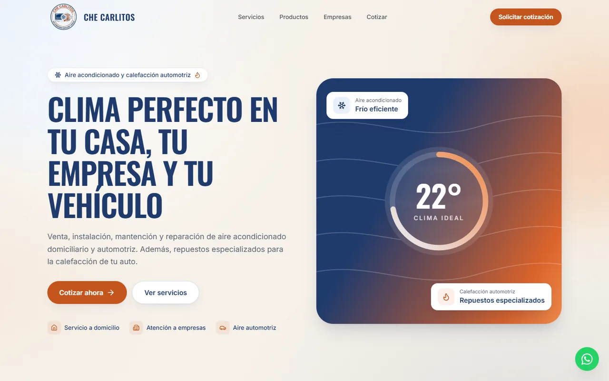
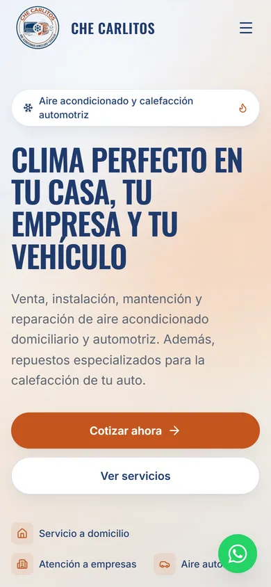
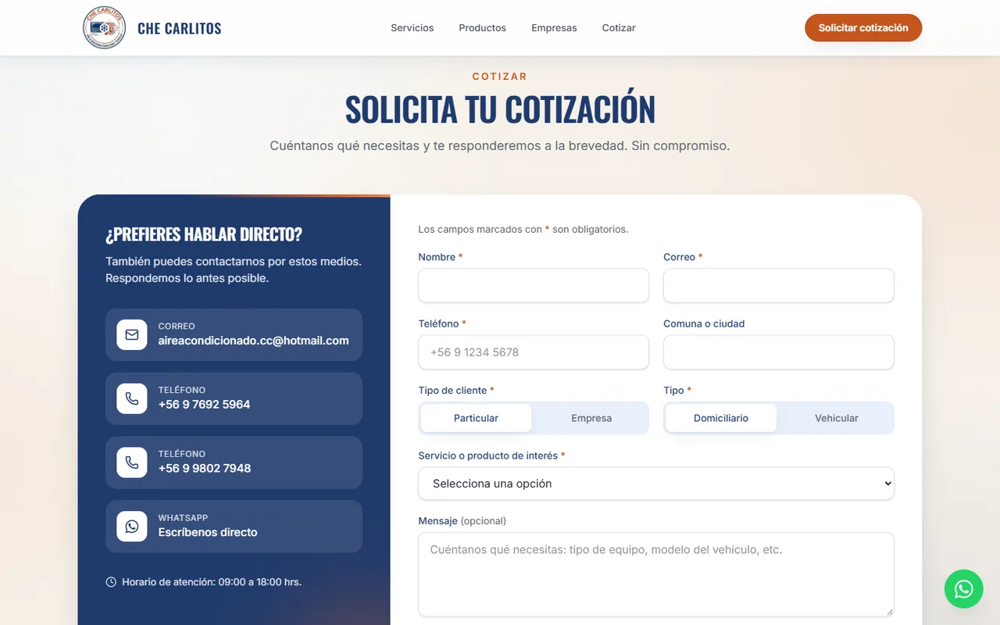
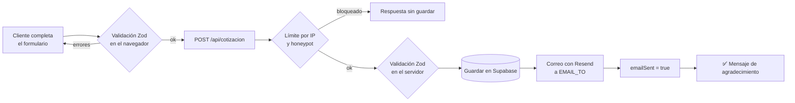

<div align="center">


# Che Carlitos

**Aire acondicionado domiciliario y vehicular · Repuestos para calefacción automotriz**

Sitio web oficial: una landing page rápida, accesible y orientada a conseguir solicitudes de cotización.

[](https://nextjs.org)
[](https://react.dev)
[](https://www.typescriptlang.org)
[](https://tailwindcss.com)
[](https://www.prisma.io)
[](https://supabase.com)
[](https://resend.com)
[](https://vercel.com)

[Sitio en producción](https://checarlitos.cl) · [Inicio rápido](#-inicio-rápido) · [Cómo editar el contenido](#️-cómo-editar-el-contenido) · [Solución de problemas](#-solución-de-problemas)

</div>

---

<p align="center">
  
  &nbsp;
  
</p>

## 📑 Contenido

- [Qué incluye](#-qué-incluye)
- [Tecnologías](#-tecnologías)
- [Inicio rápido](#-inicio-rápido)
- [Variables de entorno](#-variables-de-entorno)
- [Base de datos (Supabase + Prisma)](#️-base-de-datos-supabase--prisma)
- [Correos (Resend)](#️-correos-resend)
- [Despliegue en Vercel y dominio .cl](#-despliegue-en-vercel-y-dominio-cl)
- [Cómo editar el contenido](#️-cómo-editar-el-contenido)
- [Diseño y marca](#-diseño-y-marca)
- [Cómo funciona el formulario](#-cómo-funciona-el-formulario)
- [Estructura del proyecto](#️-estructura-del-proyecto)
- [Calidad: accesibilidad, SEO y rendimiento](#-calidad-accesibilidad-seo-y-rendimiento)
- [Scripts disponibles](#-scripts-disponibles)
- [Solución de problemas](#-solución-de-problemas)
- [Checklist antes de publicar](#-checklist-antes-de-publicar)
- [Declaración de uso de IA](#-declaración-de-uso-de-ia)

---

## ✨ Qué incluye

| | |
|---|---|
| 🧭 **Una página, todo claro** | Inicio, Servicios, Productos, Hogar vs. Vehículos, Empresas, ¿Por qué elegirnos?, Proceso en 3 pasos y Cotización, con navegación por anclas. |
| 📝 **Formulario de cotización** | Validación en el navegador y en el servidor con el mismo schema; se guarda en la base de datos **y** llega por correo, con "Responder" directo al cliente. |
| 🎯 **Cotizar en un clic** | Cada producto tiene su botón "Cotizar", que lleva al formulario con el servicio ya seleccionado. |
| 🛡️ **Anti-spam** | Campo trampa (honeypot) invisible y límite de solicitudes por IP. |
| 💬 **WhatsApp siempre visible** | Botón flotante con mensaje predefinido, y una flecha para volver al inicio que aparece al bajar por la página. |
| 🚗 **Detalles de marca** | Cursor con forma de auto que deja una brisa de aire, más intensa mientras más rápido se mueve, y un brillo de fondo sutil con los colores del logo. |
| 📱 **100 % responsivo** | Probado de 320 px (celulares pequeños) a 2560 px (monitores 2K). |
| ♿ **Accesible** | Contraste AA, foco visible, etiquetas en todos los campos, navegación por teclado y respeto por "reducir movimiento". |
| 🔎 **SEO listo** | Metadatos en español de Chile, Open Graph con imagen generada, `sitemap.xml`, `robots.txt` y datos estructurados de negocio local. |

<p align="center">
  
</p>

## 🧰 Tecnologías

| Área | Herramienta | Para qué se usa |
|---|---|---|
| Framework | **Next.js 16** (App Router) + **React 19** + **TypeScript** | Páginas, rutas de API, SEO y optimización de imágenes |
| Estilos | **Tailwind CSS 4** | Diseño con tokens de marca en `app/globals.css` |
| Base de datos | **PostgreSQL en Supabase** + **Prisma 7** | Guardar cada solicitud de cotización |
| Correo | **Resend** | Aviso de nueva cotización (y confirmación opcional al cliente) |
| Validación | **Zod 4** | Un único schema para el navegador y el servidor |
| Íconos | **lucide-react** | Íconos livianos y consistentes |
| Animación | **framer-motion** | Entradas sutiles al hacer scroll |
| Hosting | **Vercel** | Despliegue automático con cada `git push` |

## 🚀 Inicio rápido

> Requisitos: **Node.js 20.9 o superior** y **npm**.

```bash
# 1. Clonar e instalar (también genera el cliente de Prisma)
git clone https://github.com/Pauaua/CheCarlitos.git
cd CheCarlitos
npm install

# 2. Configurar variables de entorno
cp .env.example .env        # luego complétalo (ver la sección siguiente)

# 3. Crear la tabla en la base de datos (solo la primera vez)
npx prisma migrate deploy

# 4. Levantar el sitio
npm run dev                 # → http://localhost:3000
```

> 💡 El sitio se ve completo aunque no hayas configurado Supabase ni Resend; solo el envío del formulario mostrará un error hasta que lo hagas.

## 🔐 Variables de entorno

Todas van en `.env` (local) y en **Vercel → Settings → Environment Variables** (producción). El archivo `.env` **nunca** se sube a GitHub.

| Variable | Obligatoria | Pública | Descripción |
|---|:---:|:---:|---|
| `DATABASE_URL` | ✅ | — | Conexión a Supabase **con pooler** (puerto `6543`, termina en `?pgbouncer=true`). La usa el sitio. |
| `DIRECT_URL` | ✅ | — | Conexión **de sesión** (puerto `5432`). La usa Prisma para crear y modificar tablas. |
| `RESEND_API_KEY` | ✅ | — | Clave de Resend (empieza con `re_`). |
| `EMAIL_FROM` | ✅ | — | Remitente. Por defecto `Che Carlitos <onboarding@resend.dev>`. |
| `EMAIL_TO` | ✅ | — | Correo que recibe las cotizaciones: `aireacondicionado.cc@hotmail.com`. |
| `SEND_CLIENT_CONFIRMATION` | — | — | `true` para enviar confirmación al cliente (requiere dominio verificado en Resend). |
| `NEXT_PUBLIC_WHATSAPP_NUMBER` | — | ✔ | Solo dígitos con código de país, ej. `56976925964`. |
| `NEXT_PUBLIC_PHONE` | — | ✔ | Teléfono principal (también WhatsApp) tal como se muestra, ej. `+56 9 7692 5964`. |
| `NEXT_PUBLIC_PHONE_2` | — | ✔ | Segundo teléfono (solo llamadas), ej. `+56 9 9802 7948`. |
| `NEXT_PUBLIC_SITE_URL` | ✅ en producción | ✔ | URL completa **con `https://`**, ej. `https://checarlitos.cl`. |

> [!IMPORTANT]
> - Las variables `NEXT_PUBLIC_*` son visibles en el navegador. Cuando Vercel muestre la advertencia *"Public prefixes expose values to the browser"*, puedes marcarlas como **Config**, porque no son secretas.
> - `DATABASE_URL`, `DIRECT_URL` y `RESEND_API_KEY` **sí son secretas**: márcalas como sensibles.
> - Las variables `NEXT_PUBLIC_*` se incrustan al compilar: si las cambias, **vuelve a desplegar**.

## 🗄️ Base de datos (Supabase + Prisma)

### 1. Obtener las URLs de conexión

1. En [supabase.com](https://supabase.com), abre el proyecto y presiona **Connect** (arriba).
2. Ve a la pestaña **ORMs → Prisma** y copia `DATABASE_URL` y `DIRECT_URL`.
3. Reemplaza `[YOUR-PASSWORD]` por la contraseña de la base de datos, sin corchetes. Si la olvidaste: **Project Settings → Database → Reset database password**.

> Si la contraseña tiene caracteres especiales, codifícalos: `@` → `%40`, `#` → `%23`, `/` → `%2F`, `?` → `%3F`, `%` → `%25`.

### 2. Crear o actualizar las tablas

```bash
npx prisma migrate deploy     # aplica las migraciones existentes (la tabla QuoteRequest)
```

Si en el futuro modificas `prisma/schema.prisma` (por ejemplo, para agregar un campo):

```bash
npx prisma migrate dev --name descripcion-del-cambio
```

…y sube la carpeta `prisma/migrations/` a GitHub.

### 3. Ver las solicitudes recibidas

- En Supabase: **Table Editor → QuoteRequest**.
- O localmente, con una interfaz visual: `npm run db:studio`.

| Campo | Descripción |
|---|---|
| `name`, `email`, `phone` | Datos de contacto |
| `clientType` | `particular` o `empresa` (+ `companyName` opcional) |
| `city` | Comuna o ciudad |
| `service` | Servicio o producto de interés |
| `category` | `domiciliario` o `vehicular` |
| `message` | Mensaje libre |
| `emailSent` | `true` si el correo de aviso se envió correctamente |
| `createdAt` | Fecha y hora de la solicitud |

> **Nota técnica (Prisma 7):** las URLs ya no se escriben en `schema.prisma`. `DIRECT_URL` se lee en `prisma.config.ts` (migraciones) y `DATABASE_URL` en `lib/prisma.ts` (el sitio, mediante `@prisma/adapter-pg`).

## ✉️ Correos (Resend)

1. Crea una cuenta en [resend.com](https://resend.com) **con el correo `aireacondicionado.cc@hotmail.com`**.
2. Ve a **API Keys → Create API Key** (permiso *Sending access*) y copia la clave en `RESEND_API_KEY`.

> [!WARNING]
> Con el remitente de prueba `onboarding@resend.dev`, **Resend solo permite enviar al correo con el que se creó la cuenta.** Si la cuenta se crea con otro correo, las cotizaciones no llegarán (en los logs aparece el error `You can only send testing emails to your own email address`).

**Recomendado a futuro:** verifica tu dominio en Resend (**Domains → Add Domain**) y agrega en Vercel los registros DNS que te indique. Así podrás:

- enviar desde una dirección propia, como `EMAIL_FROM="Che Carlitos <contacto@checarlitos.cl>"`;
- activar `SEND_CLIENT_CONFIRMATION=true` para que cada cliente reciba un acuse de recibo.

## 🌐 Despliegue en Vercel y dominio .cl

### Despliegue

1. En [vercel.com](https://vercel.com): **Add New → Project** e importa este repositorio.
2. Agrega todas las [variables de entorno](#-variables-de-entorno).
3. Presiona **Deploy**. Desde ahí, **cada `git push` a `main` publica automáticamente**.

### Conectar el dominio de NIC Chile

NIC Chile no permite crear registros A o CNAME; solo cambiar los servidores DNS. Por eso se usan los **nameservers de Vercel**:

1. **Primero en Vercel:** **Settings → Domains → Add**, escribe `checarlitos.cl` (y `www.checarlitos.cl`) y elige la opción **Nameservers**.
2. **Luego en [nic.cl](https://www.nic.cl):** **Mis dominios →** tu dominio **→ modificar servidores DNS**:
   ```
   ns1.vercel-dns.com
   ns2.vercel-dns.com
   ```
   (Deja vacíos los campos de IP).
3. Espera la propagación (de minutos a 24 h). Vercel mostrará **Valid Configuration** y emitirá el certificado HTTPS solo.
4. Actualiza `NEXT_PUBLIC_SITE_URL=https://checarlitos.cl` y haz **Redeploy**.

> Desde ese momento, los registros DNS del dominio (por ejemplo, los de Resend o de un correo corporativo) se administran en **Vercel → Domains → DNS Records**.

## ✏️ Cómo editar el contenido

Los textos y datos están separados del diseño: **no necesitas tocar los componentes** para cambiar el contenido.

| Quiero cambiar… | Archivo |
|---|---|
| Títulos y textos de cada sección, servicios, productos, empresas, "¿Por qué elegirnos?" y pasos | [`lib/content.ts`](lib/content.ts) |
| Correo, teléfonos, WhatsApp, zona de cobertura, horario y créditos del footer | [`lib/site.ts`](lib/site.ts) (o las variables de entorno) |
| Opciones del formulario, mensajes de error y validaciones | [`lib/quote-schema.ts`](lib/quote-schema.ts) |
| Diseño del correo que llega con cada cotización | [`lib/email.ts`](lib/email.ts) |
| Título de la pestaña, descripción y palabras clave para Google | [`app/layout.tsx`](app/layout.tsx) |
| Colores, tipografías y brillo de fondo | [`app/globals.css`](app/globals.css) |
| Auto del cursor y brisa | [`public/cursors/`](public/cursors) y [`components/CursorBreeze.tsx`](components/CursorBreeze.tsx) |

### Logo y favicon

1. Reemplaza `public/logo.png` (PNG con fondo transparente, idealmente de 512 px o más).
2. Ejecuta:
   ```bash
   npm run icons
   ```
   Esto regenera `app/icon.png` (favicon) y `app/apple-icon.png` (ícono de iPhone). El header, el footer y la imagen para redes sociales usan el logo automáticamente.

### Fotos

Busca los comentarios `FOTO:` en `components/`: marcan los lugares pensados para fotos reales (hero, productos, hogar/vehículos). Guarda las imágenes en `public/fotos/` y úsalas con el componente `<Image>` de `next/image`, que las optimiza solo.

### Ajustes rápidos de efectos

| Efecto | Dónde | Qué cambiar |
|---|---|---|
| Intensidad del brillo de fondo | `app/globals.css` → bloque *Brillo de fondo* | Las opacidades (el valor después de `/`) |
| Velocidad del destello | `app/globals.css` → `animation: brillo-fondo 32s` | Más segundos = más lento |
| Color de la brisa | `components/CursorBreeze.tsx` → `COLOR` | Valores RGB |
| Sensibilidad a la velocidad | `components/CursorBreeze.tsx` → `MAX_SPEED` | Un número menor = brisa intensa con menos velocidad |
| Tamaño del auto | `public/cursors/car-*.svg` → `width` / `height` | Ajusta también el punto de clic en `globals.css` |

## 🎨 Diseño y marca

El concepto visual es el **contraste entre el frío (azul, copo de nieve) y el calor (naranjo, calefacción)** del logo.

| Token | Color | Uso |
|---|---|---|
| `brand-navy` |  | Títulos y textos fuertes |
| `brand-navy-dark` |  | Fondos oscuros y footer |
| `brand-orange` |  | Acentos y degradados |
| `brand-orange-light` |  | Hover y degradados |
| `brand-orange-dark` |  | Botones y textos naranjos (cumple contraste AA) |
| `brand-cream` |  | Fondo general |
| `brand-ice` |  | Fondos "fríos" |
| `ink` / `muted` |   | Texto principal / secundario |

- **Tipografías:** *Oswald* para títulos (condensada, como la del logo) e *Inter* para el texto, cargadas con `next/font` (sin parpadeos ni peticiones a Google desde el navegador).
- **Utilidades propias:** `bg-cold-warm` (degradado azul → naranjo) y `text-cold-warm`.
- Se usan como clases de Tailwind: `bg-brand-navy`, `text-brand-orange-dark`, `border-brand-ice`, etc.

## 📨 Cómo funciona el formulario



- **Un solo schema** (`lib/quote-schema.ts`) valida en el navegador y en el servidor, así las reglas nunca se desincronizan.
- **Nada se pierde:** si el correo falla, la solicitud queda guardada con `emailSent = false`; si falla la base de datos pero el correo sale, el cliente igual ve el mensaje de éxito. Solo si fallan ambos se le pide reintentar o escribir por WhatsApp.
- **"Responder" va directo al cliente:** el correo se envía con `replyTo` = correo del cliente.
- **Límite de abuso:** 5 solicitudes cada 10 minutos por IP (en memoria; es una protección básica por instancia).
- Los errores quedan en los logs con el prefijo `[cotizacion]`.

## 🗂️ Estructura del proyecto

```text
.
├── app/
│   ├── api/cotizacion/route.ts   # Recibe el formulario: valida, guarda y envía el correo
│   ├── layout.tsx                # Fuentes, metadatos y SEO
│   ├── page.tsx                  # Arma la página con todas las secciones
│   ├── globals.css               # Colores de marca, brillo de fondo y cursor
│   ├── opengraph-image.tsx       # Imagen para compartir en redes (generada)
│   ├── icon.png, apple-icon.png  # Favicon (generados con `npm run icons`)
│   └── robots.ts, sitemap.ts     # SEO
├── components/
│   ├── Header.tsx  Hero.tsx  Services.tsx  Products.tsx  ServiceLines.tsx
│   ├── Business.tsx  WhyUs.tsx  Process.tsx  QuoteForm.tsx  Footer.tsx
│   ├── WhatsAppButton.tsx  BackToTop.tsx  CursorBreeze.tsx
│   └── ui/                       # Piezas reutilizables (botones, títulos, animación…)
├── lib/
│   ├── content.ts                # ✏️ Todos los textos del sitio
│   ├── site.ts                   # ✏️ Datos de contacto y créditos
│   ├── quote-schema.ts           # Reglas del formulario (Zod)
│   ├── email.ts                  # Plantillas y envío con Resend
│   ├── prisma.ts                 # Conexión a la base de datos
│   └── rate-limit.ts             # Límite de solicitudes por IP
├── prisma/
│   ├── schema.prisma             # Modelo QuoteRequest
│   └── migrations/               # Historial de cambios de la base de datos
├── public/                       # logo.png, cursores y archivos estáticos
├── scripts/generate-icons.mjs    # Genera el favicon desde el logo
├── docs/                         # Capturas usadas en este README
└── prisma.config.ts              # Configuración de la CLI de Prisma
```

## ✅ Calidad: accesibilidad, SEO y rendimiento

**Accesibilidad**
- Contraste de color AA en textos y botones (por eso existe `brand-orange-dark`).
- Foco visible en todos los elementos interactivos y enlace "Saltar al contenido".
- Etiquetas en todos los campos, errores asociados a cada campo y foco automático en el primer error.
- Menú móvil navegable con teclado (se cierra con <kbd>Esc</kbd>).
- Con "reducir movimiento" activado se eliminan los desplazamientos, el destello de fondo y el cursor animado.
- Áreas táctiles de al menos 24 px.

**SEO**
- Título, descripción y palabras clave orientadas a: aire acondicionado, instalación, mantención, carga de gas, aire automotriz y repuestos de calefacción automotriz.
- Open Graph y Twitter Card con imagen generada a partir del logo.
- Datos estructurados `HVACBusiness` (Schema.org), `sitemap.xml` y `robots.txt`.
- Idioma declarado como `es-CL`.

**Rendimiento**
- Página principal pre-renderizada como estática.
- Fuentes autoalojadas con `next/font` e imágenes optimizadas con `next/image`.
- La animación de la brisa solo corre mientras hay brisa visible y no se activa en celulares.

**Probado en:** 320, 360, 375, 390 y 430 px (celulares), 667 px (celular horizontal), 768, 820 y 1024 px (tablets), y 1280, 1440, 1920 y 2560 px (escritorio), sin scroll horizontal ni textos cortados.

## 📜 Scripts disponibles

| Comando | Qué hace |
|---|---|
| `npm run dev` | Servidor de desarrollo en `http://localhost:3000` |
| `npm run build` | Compila para producción (incluye `prisma generate`) |
| `npm run start` | Sirve la versión compilada |
| `npm run lint` | Revisa el código con ESLint |
| `npm run icons` | Regenera el favicon desde `public/logo.png` |
| `npm run db:migrate` | Crea una migración nueva (`prisma migrate dev`) |
| `npm run db:deploy` | Aplica las migraciones pendientes (`prisma migrate deploy`) |
| `npm run db:studio` | Abre un explorador visual de la base de datos |

## 🩺 Solución de problemas

<details>
<summary><strong>Las cotizaciones se guardan, pero no llega el correo</strong></summary>

- Revisa en Vercel **Logs** las líneas `[cotizacion] Error al enviar el correo`.
- `You can only send testing emails to your own email address (…)` → la cuenta de Resend se creó con otro correo. Créala con `aireacondicionado.cc@hotmail.com` o verifica un dominio.
- Revisa la carpeta de **correo no deseado** de Hotmail.
- Confirma que `RESEND_API_KEY` esté en Vercel y que hiciste **Redeploy** después de agregarla.
</details>

<details>
<summary><strong>El formulario muestra "No pudimos registrar tu solicitud"</strong></summary>

Fallaron la base de datos **y** el correo a la vez. Revisa en los logs `[cotizacion] Error al guardar en la base de datos` y verifica `DATABASE_URL` (puerto `6543`, `?pgbouncer=true`) y la contraseña.
</details>

<details>
<summary><strong>El despliegue falla con "Invalid URL"</strong></summary>

`NEXT_PUBLIC_SITE_URL` debe incluir el protocolo: `https://checarlitos.cl`, no solo `checarlitos.cl`.
</details>

<details>
<summary><strong>Cambié un teléfono o la URL en Vercel y no se actualiza</strong></summary>

Las variables `NEXT_PUBLIC_*` se fijan al compilar. Ve a **Deployments → ⋯ → Redeploy**.
</details>

<details>
<summary><strong><code>prisma migrate</code> no conecta</strong></summary>

Las migraciones usan `DIRECT_URL` (puerto `5432`). Verifica la contraseña y que los caracteres especiales estén codificados.
</details>

<details>
<summary><strong>"Another next dev server is already running"</strong></summary>

Ya hay un `npm run dev` abierto. Usa ese (la terminal indica la URL) o ciérralo con el comando `taskkill /PID <número> /F` que muestra el mensaje.
</details>

<details>
<summary><strong>No veo el cursor de auto</strong></summary>

Es intencional en celulares y tablets (no tienen cursor) y cuando el sistema tiene activado "reducir movimiento". En Chrome, cerca de los bordes de la ventana, el navegador puede mostrar el cursor normal por seguridad.
</details>

## 📋 Checklist antes de publicar

- [ ] Todas las variables de entorno están en Vercel (las secretas, marcadas como sensibles).
- [ ] `NEXT_PUBLIC_SITE_URL` tiene el dominio final con `https://`.
- [ ] La tabla `QuoteRequest` existe en Supabase (`npx prisma migrate deploy`).
- [ ] Una cotización de prueba llega a `aireacondicionado.cc@hotmail.com`.
- [ ] El dominio muestra **Valid Configuration** en Vercel.
- [ ] El favicon y la imagen para redes muestran el logo real.
- [ ] Textos revisados en `lib/content.ts` y datos de contacto en `lib/site.ts`.

## 🤖 Declaración de uso de IA

Este proyecto fue **concebido, dirigido y validado por [Phantasia](https://phantasia.cl)**. En su desarrollo se utilizó **Claude** (asistente de inteligencia artificial de [Anthropic](https://www.anthropic.com)), a través de Claude Code, como herramienta de apoyo, siempre bajo su dirección y revisión.

**Aporte de Phantasia (lo esencial del proyecto)**
- La idea, el concepto y el objetivo del sitio: conseguir cotizaciones para Che Carlitos.
- La definición de la arquitectura y del stack: Next.js, Tailwind, Prisma, Supabase, Resend y Zod.
- La especificación de cada sección, el formulario, el modelo de datos y las reglas de negocio.
- La dirección de arte: la paleta tomada del logo, el concepto frío/calor, la tipografía, el estilo de referencia y los detalles de marca, como el cursor de auto con brisa y el brillo de fondo.
- La infraestructura: la base de datos en Supabase, el servicio de correo en Resend, el despliegue en Vercel, el dominio en NIC Chile y la configuración de credenciales.
- El contenido real (logo, teléfonos, correo, cobertura, horario), las decisiones finales y la aprobación de cada cambio.

**Aporte de Claude (complemento)**
- **Rapidez de implementación:** escritura del código a partir de las especificaciones de Phantasia, incluido el código repetitivo de componentes, estilos y configuración.
- **Testeos:** pruebas automatizadas en navegador (13 tamaños de pantalla, de 320 px a 2560 px), validación del formulario, prueba de guardado en la base de datos y de envío de correos, y revisión de contraste y accesibilidad.
- **Corrección de errores** detectados en esas pruebas, por ejemplo desbordes en celulares, contenido invisible con "reducir movimiento" o áreas táctiles pequeñas.
- **Apoyo en documentación:** redacción de este README y de textos de apoyo propuestos para su revisión.

Todo el contenido generado con IA fue revisado, ajustado y aprobado por Phantasia antes de publicarse.

---

<div align="center">

**Che Carlitos** · Toda la Región Metropolitana · Envíos a todo Chile<br/>
📧 aireacondicionado.cc@hotmail.com · 📞 +56 9 7692 5964 · +56 9 9802 7948

Fait avec 💜 par [Phantasia](https://phantasia.cl) · © Che Carlitos. Tous droits réservés.

</div>
